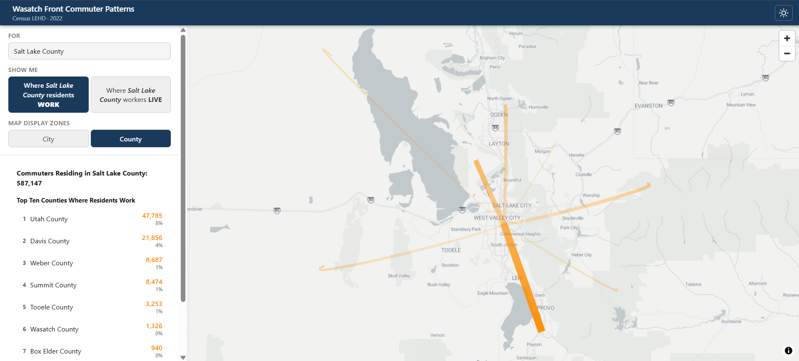

# Wasatch Front Commuter Patterns

An interactive WebAssembly-powered map for exploring commute flow patterns across the Wasatch Front region, built on open-source tools and hosted on GitHub Pages — no ArcGIS or proprietary dependencies.

**Live app:** https://ar-puuk.github.io/APP-WFRC-Commute-Patterns/



---

## Features

- **Arc flow map** — curved arcs connect origins and destinations; arc width and opacity scale with commuter volume
- **Four aggregation combinations** — select any city or county, then display destinations at city or county granularity independently
- **Both flow directions** — "where residents work" and "where workers live"
- **Top 10 list** — click any row to jump to that area
- **Light / dark mode** — full theme switching including map tiles and arc colors
- **Fully client-side** — DuckDB-WASM queries pre-processed Parquet files directly in the browser; no server or API keys required

## Data

**Source:** [US Census LEHD LODES 8](https://lehd.ces.census.gov/data/lodes/LODES8/), Origin-Destination Employment Statistics for Utah, 2022.

**Coverage:** Nine WFRC-region counties — Box Elder, Davis, Weber, Morgan, Salt Lake, Utah, Tooele, Wasatch, and Summit.

**Geography:** Block-level OD pairs are aggregated to city (Census-designated place) and county level using the LEHD geographic crosswalk. Centroids are derived from Census TIGER/Line 2020 shapefiles.

Pre-processed data files committed to the repo (`data/`) so the app runs with no server-side processing:

| File | Rows | Description |
|---|---|---|
| `data/city_flows.parquet` | 13,479 | City-to-city OD pairs with commuter counts and breakdowns by age, earnings, and industry |
| `data/county_flows.parquet` | 81 | County-to-county OD pairs |
| `data/city_meta.json` | 160 | City centroids (lat/lon from TIGER polygons) |
| `data/county_meta.json` | 9 | County centroids |

## Tech stack

| Layer | Library |
|---|---|
| Build | [Vite](https://vitejs.dev/) |
| Map | [MapLibre GL JS](https://maplibre.org/) + [Stadia Maps](https://stadiamaps.com/) tiles |
| Flow visualization | [deck.gl](https://deck.gl/) ArcLayer via `@deck.gl/mapbox` |
| In-browser data | [DuckDB-WASM](https://duckdb.org/docs/api/wasm/overview.html) querying Parquet files |
| Data pipeline | Python — pandas, GeoPandas, PyArrow |
| Python env | [uv](https://docs.astral.sh/uv/) |
| Deployment | GitHub Actions → GitHub Pages |

---

## Local development

### Prerequisites

- [Node.js](https://nodejs.org/) 18+
- [uv](https://docs.astral.sh/uv/) (for the data pipeline)

### 1. Install JS dependencies

```bash
npm install
```

### 2. Set up Python environment

```bash
uv sync
```

### 3. Re-run the data pipeline (optional)

The pre-processed `data/` files are already committed. Only re-run this if you want to refresh with a newer LEHD year or change the geographic scope.

```bash
uv run python scripts/process_data.py
```

The script downloads ~200 MB of source data (LEHD OD files + Census TIGER shapefiles) and writes the four output files into `data/`.

### 4. Start the dev server

```bash
npm run dev
```

Open `http://localhost:5173/APP-WFRC-Commute-Patterns/`.

---

## Deployment

The app deploys automatically to GitHub Pages on every push to `main` via GitHub Actions (`.github/workflows/deploy.yml`).

To enable it on a new repository:

1. Go to **Settings → Pages → Source** and select **GitHub Actions**.
2. Push to `main` — the workflow builds with Vite and deploys `dist/` to the `github-pages` environment.

---

## Project structure

```
├── index.html                  # App shell
├── vite.config.js              # Vite build config
├── package.json
├── pyproject.toml              # Python data pipeline dependencies (uv)
├── uv.lock                     # Pinned Python dependency tree
│
├── src/
│   ├── main.js                 # App entry — state, boot, visualization loop
│   ├── db.js                   # DuckDB-WASM init and query functions
│   ├── map.js                  # MapLibre + deck.gl ArcLayer
│   ├── sidebar.js              # Sidebar UI — search, toggles, stats, Top 10
│   └── styles/
│       ├── main.css            # Layout and CSS custom properties (light/dark tokens)
│       └── sidebar.css         # Sidebar-specific styles
│
├── data/                       # Pre-processed data files (committed)
│   ├── city_flows.parquet
│   ├── county_flows.parquet
│   ├── city_meta.json
│   └── county_meta.json
│
├── scripts/
│   ├── process_data.py         # Offline data pipeline
│   └── requirements.txt        # Alternative pip install reference
│
├── assets/
│   └── wfrc-logo.png
│
└── .github/
    └── workflows/
        └── deploy.yml          # GitHub Actions → GitHub Pages
```

---

## Data pipeline details

`scripts/process_data.py` runs entirely offline and produces the committed `data/` files:

1. Downloads `ut_od_main_JT00_2022.csv.gz` from LEHD (1.4 M block-level OD records)
2. Downloads the LEHD geographic crosswalk (`ut_xwalk.csv.gz`) to map blocks → city and county names
3. Filters to flows where both home and work blocks are within the WFRC 9-county region
4. Labels unincorporated blocks as `"[County] Unincorporated"`
5. Aggregates to city→city and county→county pairs, summing all job-count columns
6. Downloads Census TIGER 2020 Place and County shapefiles for Utah
7. Computes polygon centroids in Utah State Plane (EPSG:26912) and projects to WGS84
8. Exports Parquet files (Snappy-compressed) and JSON metadata

---

## Acknowledgements

- Commute data: [US Census Bureau LEHD Program](https://lehd.ces.census.gov/)
- Geography: [US Census Bureau TIGER/Line Shapefiles](https://www.census.gov/geographies/mapping-files/time-series/geo/tiger-line-file.html)
- Map tiles: [Stadia Maps](https://stadiamaps.com/) / [OpenMapTiles](https://openmaptiles.org/) / [OpenStreetMap](https://www.openstreetmap.org/copyright) contributors
