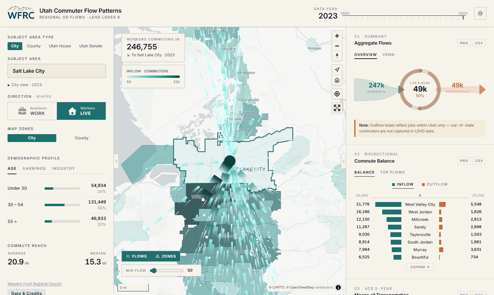
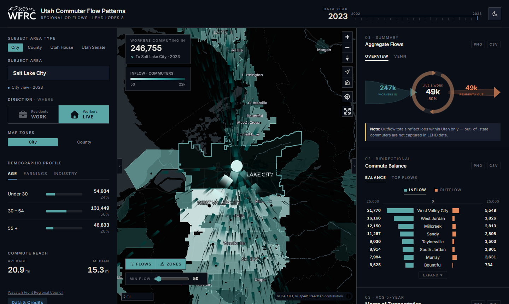

# Wasatch Front Commuter Patterns

An interactive WebAssembly-powered map for exploring commute flow patterns across Utah, built entirely on open-source tools — no ArcGIS or proprietary dependencies.

**Live app:** https://wfrc.utah.gov/maps/regional-commuter-flows/

**GitHub Pages mirror:** https://wfrcanalytics.github.io/APP-WFRC-Commute-Patterns/

| Light mode | Dark mode |
|:---:|:---:|
|  |  |

---

## Features

- **Arc flow map** — curved arcs connect origins and destinations; arc width and opacity scale with commuter volume
- **Four subject area types** — select any city, county, Utah House district, or Utah Senate district as the subject of analysis
- **Two map zone levels** — display destination choropleth and flow arcs aggregated at city or county level
- **Both flow directions** — "where residents work" and "where workers live"
- **22 years of data** — LEHD LODES data from 2002–2023; switch years from the header
- **Six chart panels** (right sidebar, collapsible and resizable):
  - *Commute Balance* — diverging bar showing top destinations and origins simultaneously
  - *Flow Diagram* — bilateral alluvial diagram (top 5 + Others per side) with a flow summary strip showing total inflow, live-and-work, and total outflow proportionally
  - *Means of Transportation* — ACS 5-Year Estimates breakdown (drove alone, carpool, transit, walk, WFH, other) for the selected area
  - *Travel Time to Work* — ACS 5-Year Estimates distribution across six time bands (< 10 min through 60+ min)
  - *Commute Reach* — distance-band distribution (< 10 mi, 10–25 mi, 25–50 mi, 50+ mi) with block-level weighted mean and median commute distance
  - *Industry Mix* — stacked bar across top-5 destinations with inflow/outflow toggle
- **Export** — every chart exports as PNG or CSV
- **Clickable zone polygons** — click any city, county, or legislative district polygon on the map to select it directly
- **Layer controls** — toggle flow lines and polygon choropleth; set a minimum-commuter threshold for flow lines
- **Gradient color legend** — top-left overlay shows the flow color scale matching arc colors exactly
- **Map controls** — zoom, compass with pitch visualization, reset tilt & north, reset to full Utah view, geolocate, fullscreen, scale bar
- **Light / dark mode** — full theme switching including map tiles, arc colors, chart colors, map controls, navbar logo, and browser favicon
- **Fully client-side** — DuckDB-WASM queries pre-processed Parquet files directly in the browser; no server or API keys required

## Data

**Source:** [US Census LEHD LODES 8](https://lehd.ces.census.gov/data/lodes/LODES8/), Origin-Destination Employment Statistics for Utah, 2002–2023.

**Coverage:** Statewide Utah — all cities (Census-designated places), all 29 counties, all 75 Utah House districts, and all 29 Utah Senate districts.

**Geography:** Block-level OD pairs are aggregated to city, county, and legislative district level using the LEHD geographic crosswalk and Census TIGER/Line 2024 block-to-district overlays. Distance columns (`dist_wsum`, `dist_n`) are pre-aggregated at block level using haversine distances, enabling exact weighted mean commute distances at any geography level. Centroids are derived from Census TIGER/Line 2024 polygon shapefiles.

Pre-processed data files are committed to the repo under `data/` so the app runs with no server-side processing:

| File | Description |
|---|---|
| `data/manifest.json` | Available years and default year |
| `data/lehd/<year>/city_flows.parquet` | City-to-city OD pairs — commuter counts, age/earnings/industry breakdowns, distance bands, block-level distance sums |
| `data/lehd/<year>/county_flows.parquet` | County-to-county OD pairs (same columns) |
| `data/lehd/<year>/district_flows.parquet` | House- and senate-district OD pairs carrying all four geography columns for cross-type queries |
| `data/lehd/<year>/city_meta.json` | City centroids (lat/lon from TIGER polygons) |
| `data/lehd/<year>/county_meta.json` | County centroids |
| `data/lehd/<year>/house_meta.json` | House district centroids and FIPS codes |
| `data/lehd/<year>/senate_meta.json` | Senate district centroids and FIPS codes |
| `data/city_boundaries.geojson` | City polygon boundaries for choropleth |
| `data/county_boundaries.geojson` | County polygon boundaries for choropleth |
| `data/house_boundaries.geojson` | Utah House district polygon boundaries |
| `data/senate_boundaries.geojson` | Utah Senate district polygon boundaries |
| `data/acs/<year>/acs_city.json` | ACS 5-Year Estimates keyed by 7-digit place FIPS (~320 Utah places) — transportation mode and travel time distributions |
| `data/acs/<year>/acs_county.json` | ACS 5-Year Estimates keyed by 5-digit county FIPS (29 Utah counties) |
| `data/acs/<year>/acs_house.json` | ACS 5-Year Estimates keyed by 5-digit state-legislative-lower FIPS |
| `data/acs/<year>/acs_senate.json` | ACS 5-Year Estimates keyed by 5-digit state-legislative-upper FIPS |

## Tech stack

| Layer | Library |
|---|---|
| Build | [Vite](https://vitejs.dev/) |
| Map | [MapLibre GL JS](https://maplibre.org/) + [CARTO](https://carto.com/) GL vector tiles |
| Flow visualization | [Flowmap.gl](https://flowmap.gl/) FlowmapLayer via `@deck.gl/mapbox` |
| Charts | Custom SVG / DOM — no charting library |
| In-browser data | [DuckDB-WASM](https://duckdb.org/docs/api/wasm/overview.html) querying Parquet files |
| Data pipeline | Python — pandas, GeoPandas, PyArrow |
| Python env | [uv](https://docs.astral.sh/uv/) |
| Deployment | GitHub Actions → WFRC FTP + GitHub Pages |

---

## Local development

### Prerequisites

- [Node.js](https://nodejs.org/) 18+
- [uv](https://docs.astral.sh/uv/) (for the data pipeline)

### 1. Install JS dependencies

```bash
npm install
```

### 2. Set up Python environment

```bash
uv sync
```

### 3. Re-run the data pipeline (optional)

The pre-processed `data/` files are already committed. Only re-run this if you want to refresh with a newer LEHD year or change the geographic scope.

```bash
uv run python scripts/process_data.py
```

The script downloads LEHD OD files and Census TIGER shapefiles and writes the output files into `data/`.

### 4. Start the dev server

```bash
npm run dev
```

Open `http://localhost:5173/APP-WFRC-Commute-Patterns/`.

---

## Deployment

Every push to `master` triggers two parallel deploy jobs via GitHub Actions (`.github/workflows/deploy.yml`):

| Target | URL | Build base |
|---|---|---|
| WFRC web server (FTP) | https://wfrc.utah.gov/maps/regional-commuter-flows/ | `./` (relative) |
| GitHub Pages (mirror) | https://wfrcanalytics.github.io/APP-WFRC-Commute-Patterns/ | `/APP-WFRC-Commute-Patterns/` |

The FTP job requires three repository secrets: `FTP_HOST`, `FTP_USERNAME`, `FTP_PASSWORD`.

To enable GitHub Pages on a new repository fork:

1. Go to **Settings → Pages → Source** and select **GitHub Actions**.
2. Push to `master` — the workflow builds and deploys `dist/` to the `github-pages` environment.

---

## Project structure

```
├── index.html                  # App shell
├── vite.config.js              # Vite build config
├── package.json
├── pyproject.toml              # Python data pipeline dependencies (uv)
├── uv.lock                     # Pinned Python dependency tree
│
├── src/
│   ├── main.js                 # App entry — state, boot, visualization loop
│   ├── db.js                   # DuckDB-WASM init and query functions
│   ├── map.js                  # MapLibre + Flowmap.gl + map controls
│   ├── sidebar.js              # Sidebar UI — search, toggles, stats, Top 10
│   ├── charts.js               # ECharts panels — all 5 charts + exports
│   └── styles/
│       ├── main.css            # Layout and CSS custom properties (light/dark tokens)
│       ├── sidebar.css         # Sidebar-specific styles
│       ├── charts.css          # Right panel chart section styles
│       └── toolbar.css         # Map overlay toolbar + MapLibre control theme overrides
│
├── data/                       # Pre-processed data files (committed)
│   ├── manifest.json           # Available years list
│   ├── city_boundaries.geojson
│   ├── county_boundaries.geojson
│   ├── house_boundaries.geojson
│   ├── senate_boundaries.geojson
│   ├── custom_places.gpkg      # Custom place boundaries (e.g. Hill Air Force Base)
│   ├── acs/                        # ACS 5-Year Estimates (one directory per year)
│   │   └── <year>/
│   │       ├── acs_city.json
│   │       ├── acs_county.json
│   │       ├── acs_house.json
│   │       └── acs_senate.json
│   └── lehd/                       # LEHD LODES flow data (one directory per year)
│       └── <year>/                 # 2002–2023
│           ├── city_flows.parquet
│           ├── county_flows.parquet
│           ├── district_flows.parquet
│           ├── city_meta.json
│           ├── county_meta.json
│           ├── house_meta.json
│           └── senate_meta.json
│
├── scripts/
│   ├── process_data.py         # Offline data pipeline (LEHD + TIGER + ACS)
│   ├── fetch_acs.py            # Fetches ACS 5-Year Estimates via Census API
│   ├── custom_places.py        # Modular extension for non-Census employment sites
│   ├── verify_custom_places.py # LEHD coverage audit for custom places
│   └── screenshot.cjs          # Playwright script — captures light/dark screenshots into docs/
│
├── public/
│   ├── favicon-light.svg           # Theme-aware favicon (light mode)
│   └── favicon-dark.svg            # Theme-aware favicon (dark mode)
│
├── assets/
│   └── logo/
│       ├── WFRC_logo_abbreviated_color_transparent.png   # Navbar logo (light mode)
│       └── WFRC_logo_abbreviated_white_transparent.png   # Navbar logo (dark mode)
│
└── .github/
    └── workflows/
        └── deploy.yml          # GitHub Actions → WFRC FTP + GitHub Pages
```

---

## Data pipeline details

`scripts/process_data.py` runs entirely offline and produces the committed `data/` files:

1. Downloads `ut_od_main_JT00_<year>.csv.gz` from LEHD (block-level OD records for all of Utah)
2. Downloads the LEHD geographic crosswalk (`ut_xwalk.csv.gz`) to map blocks → city and county names
3. Labels unincorporated blocks as `"[County] Unincorporated"`
4. Computes block-level haversine distances and pre-aggregates `dist_wsum` (sum of `workers × miles`) and `dist_n` (worker count with valid coordinates) for exact weighted mean commute distances at any geography level
5. Aggregates to city→city, county→county, and legislative district OD pairs, summing all job-count and distance columns
6. Downloads Census TIGER 2024 Place, County, and State Legislative District shapefiles for Utah; overlays block centroids to assign house/senate districts
7. Computes polygon centroids in Utah State Plane (EPSG:26912) and projects to WGS84
8. Exports Parquet files (Snappy-compressed), JSON metadata, and GeoJSON boundaries for all four geography levels
9. Fetches ACS 5-Year Estimates via the Census API (tables B08301/B08601 for means of transportation, B08303/B08603 for travel time to work) for cities, counties, House districts, and Senate districts; writes `data/acs/<year>/acs_{city,county,house,senate}.json`; skip with `--skip-acs` if a Census API key is unavailable

---

## Acknowledgements

- Commute data: [US Census Bureau LEHD Program](https://lehd.ces.census.gov/)
- Commute characteristics: [US Census Bureau American Community Survey 5-Year Estimates](https://www.census.gov/programs-surveys/acs/data.html)
- Geography: [US Census Bureau TIGER/Line Shapefiles](https://www.census.gov/geographies/mapping-files/time-series/geo/tiger-line-file.html)
- Map tiles: [CARTO](https://carto.com/attributions) / [OpenStreetMap](https://www.openstreetmap.org/copyright) contributors
